# DB テーブル設計

## 目的

PostgreSQL 上のテーブル、制約、リレーション、初期データを固定する。実装の正は `db/init.sql`、説明の正はこの設計書とする。

## 対象外

- 部門・役職マスターの CRUD API
- 論理削除
- ページネーション用インデックス
- HTTP リクエスト／レスポンスの JSON Schema（各エンドポイント設計）
- 呼び出し側 UI・クライアント実装

## 命名（DB）

| 対象 | 規則 |
| --- | --- |
| テーブル・列 | スネークケース、複数形のテーブル名 |
| 主キー | 各テーブルの `id`（INTEGER、IDENTITY） |
| 外部キー | `{参照テーブル単数}_id` |

## 全テーブル共通列

次の列を **すべてのテーブル** に持つ。

| 列 | 型 | NULL | 制約 | 既定 | 説明 |
| --- | --- | --- | --- | --- | --- |
| created_at | TIMESTAMPTZ | NO | — | `CURRENT_TIMESTAMP` | 行の作成日時 |
| updated_at | TIMESTAMPTZ | NO | — | `CURRENT_TIMESTAMP` | 行の最終更新日時。更新時はアプリまたは DB トリガーで必ず更新する |

業務上の日付（入社日・生年月日・利用期間）は `DATE`、監査用の作成・更新は `TIMESTAMPTZ` とする。

各テーブルに `BEFORE UPDATE` トリガーを置き、行更新時に `updated_at = CURRENT_TIMESTAMP` とする。定義は `db/init.sql` に含める。

## ER（DB）

```mermaid
erDiagram
  departments ||--o{ employees : "department_id"
  positions ||--o{ employees : "position_id"

  departments {
    integer id PK
    text name UK
    date valid_from
    date valid_to
    timestamptz created_at
    timestamptz updated_at
  }

  positions {
    integer id PK
    text name UK
    date valid_from
    date valid_to
    timestamptz created_at
    timestamptz updated_at
  }

  employees {
    integer id PK
    text name
    date join_date
    integer department_id FK
    integer position_id FK
    boolean is_full_time
    date birth_date
    timestamptz created_at
    timestamptz updated_at
  }
```

削除規則は PostgreSQL の既定（`NO ACTION`）。部門・役職を参照している従業員がいるあいだはマスターを消せない。

## departments（部門マスター）— DB

従業員の部署。

| 列 | 型 | NULL | 制約 | 既定 | 説明 |
| --- | --- | --- | --- | --- | --- |
| id | INTEGER | NO | PK、`GENERATED BY DEFAULT AS IDENTITY` | 自動採番 | 部門 ID |
| name | TEXT | NO | UNIQUE | — | 部署名。`Market` / `Finance` / `Development` |
| valid_from | DATE | NO | — | — | 利用開始日（この日を含む） |
| valid_to | DATE | YES | `CHECK (valid_to IS NULL OR valid_to >= valid_from)` | NULL | 利用終了日（この日を含む）。NULL は継続中 |
| created_at | TIMESTAMPTZ | NO | — | `CURRENT_TIMESTAMP` | 作成日時 |
| updated_at | TIMESTAMPTZ | NO | — | `CURRENT_TIMESTAMP` | 更新日時 |

## positions（役職マスター）— DB

従業員の役職。従業員は `position_id` で参照する。

| 列 | 型 | NULL | 制約 | 既定 | 説明 |
| --- | --- | --- | --- | --- | --- |
| id | INTEGER | NO | PK、`GENERATED BY DEFAULT AS IDENTITY` | 自動採番 | 役職 ID |
| name | TEXT | NO | UNIQUE | — | 役職名。`Staff` / `Manager` / `Director` |
| valid_from | DATE | NO | — | — | 利用開始日（この日を含む） |
| valid_to | DATE | YES | `CHECK (valid_to IS NULL OR valid_to >= valid_from)` | NULL | 利用終了日（この日を含む）。NULL は継続中 |
| created_at | TIMESTAMPTZ | NO | — | `CURRENT_TIMESTAMP` | 作成日時 |
| updated_at | TIMESTAMPTZ | NO | — | `CURRENT_TIMESTAMP` | 更新日時 |

## employees（従業員）— DB

従業員の本体。部署・役職はマスターを外部キーで参照し、部署名を列に持たない。

| 列 | 型 | NULL | 制約 | 既定 | 説明 |
| --- | --- | --- | --- | --- | --- |
| id | INTEGER | NO | PK、`GENERATED BY DEFAULT AS IDENTITY` | 自動採番 | 従業員 ID |
| name | TEXT | NO | — | — | 氏名 |
| join_date | DATE | NO | — | — | 入社日（日付のみ） |
| department_id | INTEGER | NO | FK → `departments.id` | — | 部署 |
| position_id | INTEGER | NO | FK → `positions.id` | — | 役職 |
| is_full_time | BOOLEAN | NO | — | — | 正社員かどうか |
| birth_date | DATE | YES | — | NULL | 生年月日（日付のみ）。NULL 可 |
| created_at | TIMESTAMPTZ | NO | — | `CURRENT_TIMESTAMP` | 作成日時 |
| updated_at | TIMESTAMPTZ | NO | — | `CURRENT_TIMESTAMP` | 更新日時 |

シードで `id` 1〜3 を入れたあと、各テーブルの次の INSERT は 4 から始まる（`setval`）。

## 初期データ（DB シード）

ここは **DB に INSERT する行**である。`db/init.sql` がコンテナ初回起動時に投入する。いずれも 3 件。

`created_at` / `updated_at` は投入時の `CURRENT_TIMESTAMP`（既定値）でよい。

### departments

| id | name | valid_from | valid_to |
| --- | --- | --- | --- |
| 1 | Market | 2020-01-01 | NULL |
| 2 | Finance | 2020-01-01 | NULL |
| 3 | Development | 2020-01-01 | NULL |

### positions

| id | name | valid_from | valid_to |
| --- | --- | --- | --- |
| 1 | Staff | 2020-01-01 | NULL |
| 2 | Manager | 2020-01-01 | NULL |
| 3 | Director | 2020-01-01 | NULL |

### employees

| id | name | join_date | department_id | position_id | is_full_time | birth_date |
| --- | --- | --- | --- | --- | --- | --- |
| 1 | Edward Perry | 2025-07-16 | 2（Finance） | 2（Manager） | true | 2000-03-12 |
| 2 | Josephine Drake | 2025-07-16 | 1（Market） | 1（Staff） | false | 1989-11-04 |
| 3 | Cody Phillips | 2025-07-16 | 3（Development） | 1（Staff） | true | 2006-08-21 |

## 受け入れ条件

- テーブルは `departments` / `positions` / `employees` の 3 つである
- 3 テーブルすべてに `created_at` / `updated_at`（`TIMESTAMPTZ`）がある
- `departments` / `positions` に `valid_from` / `valid_to` があり、期間の `CHECK` がある
- `employees.department_id` は `departments.id` を参照する
- `employees.position_id` は `positions.id` を参照する
- 更新時に `updated_at` が変わる（トリガー）
- 初回起動後、各テーブルにシード 3 件がある
- `join_date` / `birth_date` / `valid_from` / `valid_to` は `DATE` である
- スキーマ変更は `db/init.sql` とこの設計書を同時に直す

## 次の段階

Docker 起動は [02-postgres.md](./02-postgres.md)、従業員 API は [02-employees-overview.md](./02-employees-overview.md) を参照する。
