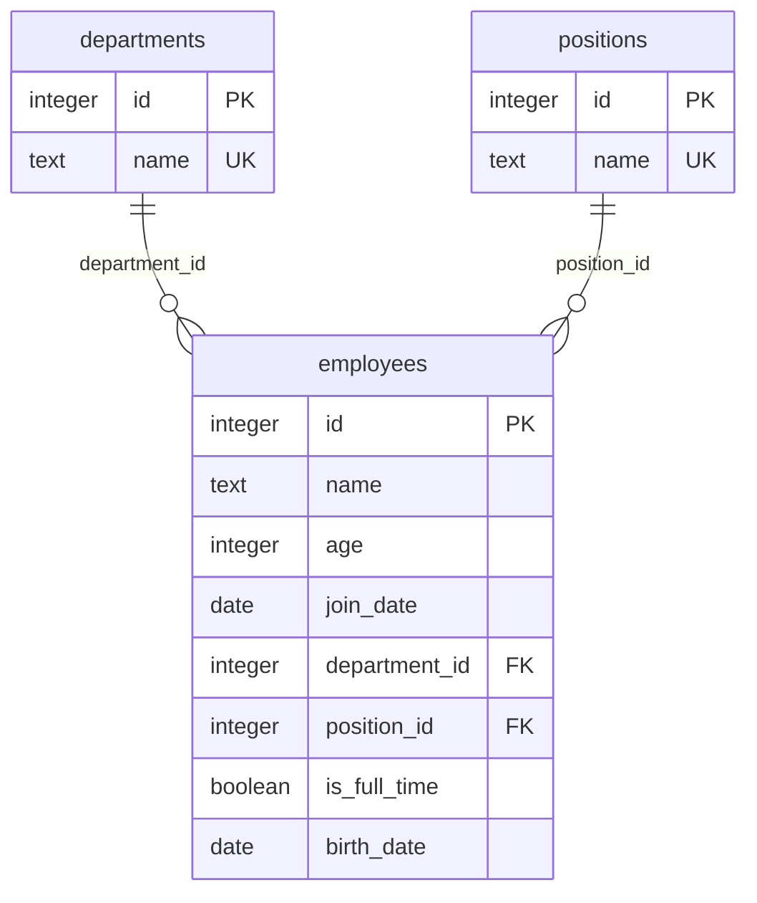

# DB テーブル設計

## 目的

PostgreSQL 上のテーブル、制約、リレーション、初期データを固定する。実装の正は `db/init.sql`、説明の正はこの設計書とする。

## 対象外

- 部門・役職マスターの CRUD API
- 論理削除
- 監査列（`created_at` / `updated_at`）
- ページネーション用インデックス

## 命名

| 対象 | 規則 |
| --- | --- |
| テーブル・列 | スネークケース、複数形のテーブル名 |
| 主キー | 各テーブルの `id`（INTEGER、IDENTITY） |
| 外部キー | `{参照テーブル単数}_id` |
| API JSON | キャメルケース。対応は各列の「API」欄 |

## ER

削除規則は PostgreSQL の既定（`NO ACTION`）。部門・役職を参照している従業員がいるあいだはマスターを消せない。

## departments（部門マスター）

従業員の部署。フロントの `role`（画面上は Department）の値は、この `name` を返す。

| 列 | 型 | NULL | 制約 | 既定 | API | 説明 |
| --- | --- | --- | --- | --- | --- | --- |
| id | INTEGER | NO | PK、`GENERATED BY DEFAULT AS IDENTITY` | 自動採番 | — | 部門 ID |
| name | TEXT | NO | UNIQUE | — | 従業員の `role` | 部署名。`Market` / `Finance` / `Development` |

## positions（役職マスター）

従業員の役職。API にはまだ出さない。従業員は `position_id` で参照する。

| 列 | 型 | NULL | 制約 | 既定 | API | 説明 |
| --- | --- | --- | --- | --- | --- | --- |
| id | INTEGER | NO | PK、`GENERATED BY DEFAULT AS IDENTITY` | 自動採番 | — | 役職 ID |
| name | TEXT | NO | UNIQUE | — | （未公開） | 役職名。`Staff` / `Manager` / `Director` |

## employees（従業員）

従業員の本体。部署・役職はマスターを外部キーで参照し、部署名を列に持たない。

| 列 | 型 | NULL | 制約 | 既定 | API | 説明 |
| --- | --- | --- | --- | --- | --- | --- |
| id | INTEGER | NO | PK、`GENERATED BY DEFAULT AS IDENTITY` | 自動採番 | id | 従業員 ID |
| name | TEXT | NO | — | — | name | 氏名 |
| age | INTEGER | NO | `CHECK (age > 0)` | — | age | 年齢 |
| join_date | DATE | NO | — | — | joinDate | 入社日（日付のみ） |
| department_id | INTEGER | NO | FK → `departments.id` | — | role | JOIN した `departments.name` を返す |
| position_id | INTEGER | NO | FK → `positions.id` | — | （未公開） | 役職 |
| is_full_time | BOOLEAN | NO | — | — | isFullTime | 正社員かどうか |
| birth_date | DATE | YES | — | NULL | birthDate | 生年月日（日付のみ）。無ければキー省略 |

`join_date` / `birth_date` は業務上の日付なので `DATE` にする。タイムゾーン付き時刻（`TIMESTAMPTZ`）にはしない。

API ではフロント互換のため `YYYY-MM-DDT00:00:00.000Z` に変換して返す。リクエストも同様に受け取り、保存時は日付部分だけを `DATE` にする。

シードで `id` 1〜3 を入れたあと、各テーブルの次の INSERT は 4 から始まる（`setval`）。

## 初期データ

`db/init.sql` がコンテナ初回起動時に投入する。いずれも 3 件。

### departments

| id | name |
| --- | --- |
| 1 | Market |
| 2 | Finance |
| 3 | Development |

### positions

| id | name |
| --- | --- |
| 1 | Staff |
| 2 | Manager |
| 3 | Director |

### employees

| id | name | age | join_date | department_id | position_id | is_full_time | birth_date |
| --- | --- | --- | --- | --- | --- | --- | --- |
| 1 | Edward Perry | 25 | 2025-07-16 | 2（Finance） | 2（Manager） | true | 2000-03-12 |
| 2 | Josephine Drake | 36 | 2025-07-16 | 1（Market） | 1（Staff） | false | 1989-11-04 |
| 3 | Cody Phillips | 19 | 2025-07-16 | 3（Development） | 1（Staff） | true | 2006-08-21 |

従業員の画面向けシード（`role` 名）は [02-employees-overview.md](./02-employees-overview.md) と一致させる。

## 受け入れ条件

- テーブルは `departments` / `positions` / `employees` の 3 つである
- `employees.department_id` は `departments.id` を参照する
- `employees.position_id` は `positions.id` を参照する
- 初回起動後、各テーブルにシード 3 件がある
- `join_date` / `birth_date` は `DATE` である
- スキーマ変更は `db/init.sql` とこの設計書を同時に直す

## 次の段階

Docker 起動は [02-postgres.md](./02-postgres.md)、従業員 API は [02-employees-overview.md](./02-employees-overview.md) を参照する。
